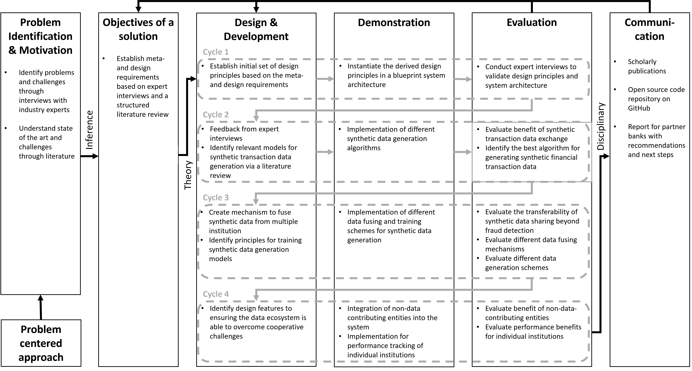

# FinDEx: A Synthetic Data Sharing Ecosystem (Online Appendix)

The following repository contains the online appendix for the paper FinDEx: A Synthetic Data Sharing Ecosystem. It not only provides the python code for all experiments conducted in the different design cycles but also background for literature reviews and intewrviews. Below you find the overall structure of the research project:

Furthermore, the following sections will briefly describe the steps conducted within each cycle.

## [Cycle 1: Initial Design Principles](Cycle1_InitialDesignPrinciples/README.MD)
In the first cycle of the Design Science Research Methodology (DSRM) project, foundational design principles (DPs) were developed to create a synthetic data ecosystem for financial institutions. These principles were derived from expert interviews, relevant literature, and domain requirements. Buidling on these DPs multi-layered architecture was proposed, with a local processing layer for secure data handling and a global layer for data sharing and fraud detection. The derived DPs as well as the architecture where then validated by experts.

## [Cycle 2: Synthetic financial transaction data generation and privacy](Cycle2_AlgorithmComparison/README.MD)
In the second cycle of the DSRM project, DP2 was refined by exploring various methods for synthetic data generation, addressing prior expert feedback. A systematic literature review identified algorithms like GANs, Gaussian mixture models, and variational autoencoders, which were tested on a financial fraud detection dataset. Privacy checks confirmed the safety of the generated data. The findings underscored the importance of combining synthetic and real data, leading to a new design principle (DP5) and an updated system architecture.

## [Cycle 3: Local Synthetic data recombination and usage](Cycle3+4_EcosystemEvaluation/README.MD)
In the third cycle of the DSRM project, the scope of the synthetic data ecosystem was expanded to validate its versatility across applications beyond fraud detection, including money laundering detection. This cycle refined DP5 by exploring the optimal mix of synthetic and real data for machine learning, and DP2 by improving methods for training synthetic data models. Evaluations showed that synthetic data enhances model performance across different contexts, with the optimal mix-in percentage varying by institution, leading to a refined DP5. The best results were achieved by pre-training minority class models with majority class data, prompting updates to DP2.

## [Cycle 4: Network Effects of Financial Data Sharing](Cycle3+4_EcosystemEvaluation/README.MD)
In the fourth cycle of the DSRM project, the focus was on addressing cooperative challenges in the global data layer of the synthetic financial data ecosystem. Drawing from literature and expert insights, the design principles (DPs) were refined to ensure the platform could effectively manage trust, participant benefits, the right number of participants, and interoperability within the ecosystem. This cycle introduced DP6, allowing regulators to access synthetic data to enhance trust and collaboration. DP3 was also extended to evaluate performance gains across institutions, ensuring all participants benefit from the ecosystem. Evaluations confirmed that the platform supports substantial performance improvements even with partial participation, validating the refined DPs and demonstrating the ecosystem's potential for broader application.

## Additional Notes
- All code provided as part of this project is written in Python 3.8